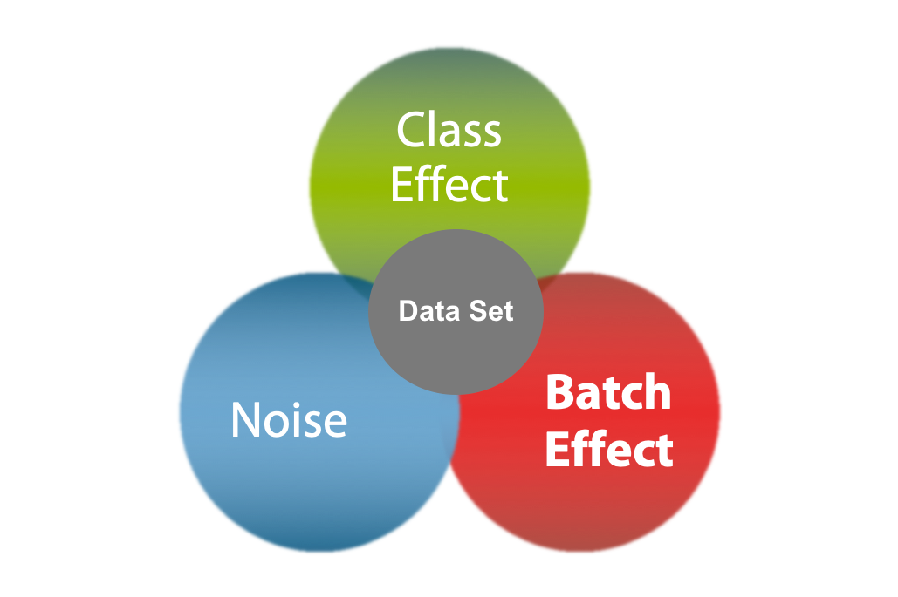

MBECS - Microbiome Batch-Effect Correction Suite
================
Michael Olbrich
9/20/2021

-   [Introduction](#introduction)
    -   [Installation](#installation)
    -   [Usage](#usage)
        -   [Preliminary Report Pipeline
            (PRP)](#preliminary-report-pipeline-prp)
        -   [Comparative Report Pipeline
            (CRP)](#comparative-report-pipeline-crp)
    -   [Pipeline](#pipeline)
    -   [Simulation](#simulation)
    -   [Acknowledgements](#acknowledgements)
-   [Batch Effect Correction Algorithms
    (BECA)](#batch-effect-correction-algorithms-beca)
    -   [BE Assessment](#be-assessment)
        -   [Linear (Mixed) Models](#linear-mixed-models)
        -   [Surrogate Variable Analysis
            (SVA)](#surrogate-variable-analysis-sva)
        -   [Remove Unwanted Variation
            (RUV)](#remove-unwanted-variation-ruv)
    -   [BE Correction](#be-correction)
        -   [Remove Unwanted Variation
            (RUV-3)](#remove-unwanted-variation-ruv-3)
        -   [Batch Mean Centering (BMC)](#batch-mean-centering-bmc)
        -   [Combatting batch effects when combining batches of
            microarray data
            (ComBat)](#combatting-batch-effects-when-combining-batches-of-microarray-data-combat)
        -   [Remove Batch Effects (RBE)](#remove-batch-effects-rbe)
        -   [FABatch (FAB)](#fabatch-fab)
        -   [Percentile Normalization
            (PN)](#percentile-normalization-pn)
        -   [Singular Value Decomposition
            (SVD)](#singular-value-decomposition-svd)
-   [Reporting Tools](#reporting-tools)
    -   [Study Summary](#study-summary)
        -   [Relative Log-Ratio Expression
            (RLE)](#relative-log-ratio-expression-rle)
        -   [Heatmap (HEAT)](#heatmap-heat)
        -   [Principal Component Analysis
            (PCA)](#principal-component-analysis-pca)
        -   [Box-plots (BOX)](#box-plots-box)
        -   [Study Design (MOSAIC)](#study-design-mosaic)
    -   [Variance Assessment](#variance-assessment)
        -   [Linear Model (LM)](#linear-model-lm)
        -   [Linear (Mixed) Model (LMM)](#linear-mixed-model-lmm)
        -   [Redundancy Analysis (pRDA)](#redundancy-analysis-prda)
        -   [PrincipalVariance Component Analysis
            (PVCA)](#principalvariance-component-analysis-pvca)
        -   [Silhouette Coefficient](#silhouette-coefficient)
-   [Bibliography](#bibliography)

# Introduction

The Microbiome Batch-Effect Correction Suite aims to provide a toolkit
for stringent assessment and correction of batch-effects in microbiome
data sets. To that end, the package offers wrapper-functions to
summarize study-design and data, e.g., PCA, Heatmap and Mosaic-plots,
and to estimate the proportion of variance that can be attributed to the
batch effect. The ‘mbecsCorrection’ function acts as a wrapper for
various batch effects correction algorithms (BECA) and in conjunction
with the aforementioned tools, it can be used to compare the
effectiveness of correction methods on particular sets of data. All
functions of this package are accessible on their own or within the
preliminary and comparative report pipelines respectively.

([Gloor et al. 2017](#ref-gloor2017))

    ## figure out what to put here - just leave out - or put on top of the introductory text

This section provides an overview of how to install and use the MBECS
package.

## Installation

As of now the package is only available through github. To install form
that source type:

    ## ToDo: provide installation instructions - last thing in pkg-dev.

Text from ‘acknowledgements’ - ToDo: fix this and acknowledgements to be
separate.

The package is designed to rely on as little dependencies as possible to
hopefully improve its longevity. To that end, some functions of smaller,
less well know packages (basically everything that I don’t trust to be
maintained and supported over the coming years AND everything that is
just one function of a much larger package AND sth. like Percentile
normalization which is available as python code and probably also for R
in some git, but it is well described in the respective publication and
thus very easy to implement). The packages still relies on a host of
packages though.

|  Package  | Version  |    Date    | Repository |
|:---------:|:--------:|:----------:|:----------:|
|  bapred   |   1.0    | 2016-06-02 |    CRAN    |
|  cluster  |  2.1.2   | 2021-04-16 |    CRAN    |
|   dplyr   |  1.0.7   |    NULL    |    CRAN    |
|  ggplot2  |  3.3.5   |    NULL    |    CRAN    |
| gridExtra |   2.3    |    NULL    |    CRAN    |
|   limma   |  3.44.3  | 2020-06-12 |    NULL    |
|   lme4    | 1.1.27.1 |    NULL    |    CRAN    |
| lmerTest  |  3.1.3   |    NULL    |    CRAN    |
|   pals    |   1.7    | 2021-04-16 |    CRAN    |
|  permute  |  0.9.5   | 2019-03-10 |    CRAN    |
| pheatmap  |  1.0.12  | 2018-12-26 |    CRAN    |
| rmarkdown |   2.10   |    NULL    |    CRAN    |
|    ruv    | 0.9.7.1  | 2019-08-30 |    CRAN    |
|    sva    |  3.36.0  |    NULL    |    NULL    |
|  tibble   |  3.1.2   |    NULL    |    CRAN    |
|   tidyr   |  1.1.3   |    NULL    |    CRAN    |
|   vegan   |  2.5.7   |    NULL    |    CRAN    |
|  methods  |  4.0.2   |    NULL    |    NULL    |

MBECS package dependencies

## Usage

just some lines of code to describe the most basic functionality

-   outline list(cnts,meta), phyloseq and MbecData input types
-   requirements for inputs
-   outputs

<!-- -->

    ## ToDo: add code and testdata(?) to show usage.

### Preliminary Report Pipeline (PRP)

    ## ToDo: add code and testdata(?) to show usage.

### Comparative Report Pipeline (CRP)

    ## ToDo: add code and testdata(?) to show usage.

## Pipeline

The package provides two pipelines that incorporate the different
functions. The Preliminary Report Pipeline (PRP) takes the pre-processed
data and presents summary and plots with regards to covariates of
interest, e.g., treatment or case/control-grouping, and known
batch-effects. The output is summarized in a html-markdown document. The
comparative report pipeline (CRP) applies selected BECAs to the input
data and creates a comparison that incorporates all the features of the
PRP with the addition that all plots and tables are now displayed as
panels that facilitate easy comparison between the different correction
methods.

    Figure 1. preliminary pipeline

    Figure 2. comparative pipeline

## Simulation

-   unclear if I really want to do that - min. is a month to implement
    and is not obvious what the benfit would be
-   also level of sophistication is unclear –&gt; because this could
    technically go to sequence level detail with compositional-profile
    templates and a bunch of distributions to select for simulation
    –&gt; but then it would take probably like 2months to implement and
    test that..
-   IF this will be done:

The simulation functions offer the ability to create mockup data for
algorithm testing. The general idea is to provide a tool that is able to
create ‘life-like’ data, i.e., SO!!! the best possible option would be
to feed existing microbial communal-composition profiles and create the
‘RAW’ sequencing files, i.e., before assigning taxonomy. That way one
can control aspects such as sample-/group-wise compositions, level of
noise, type and size of biological effects (‘type’ meaning how it
affects which features) and especially type and size of the actual
batche effect. And since the data prior to all the processing steps is
perfectly characterized - it would be straightforward to assess the
quality of different BECAs for this particular data-set.

    ## IF simulation is included - put a flow diagram of the process here

## Acknowledgements

The package is designed to rely on as little dependencies as possible to
hopefully improve its longevity. To that end, some functions of smaller,
less well know packages (basically everything that I don’t trust to be
maintained and supported over the coming years AND everything that is
just one function of a much larger package AND sth. like Percentile
normalization which is available as python code and probably also for R
in some git, but it is well described in the respective publication and
thus very easy to implement). The packages still relies on a host of
packages though.

-   microbiome be tutorial
-   CLR/ILR (???) maybe just remove from package as transformation
    functions are not really the goal here
-   Percentile Norm.. but this will be described in methods again

<!-- -->

    ## Put a table with dependency packages and their minimal version?!

# Batch Effect Correction Algorithms (BECA)

-   general outline of BE and why they need to be taken care of
-   and put a more detailed description at the end of this chapter
    maybe - or sth.
-   basically an outline of all provided methods, followed by an
    explanatory-section for every one

The Batch Effect (BE) is a collective term for cumulative technical
artefacts that emerge due sampling and processing in distinct batches,
i.e., sub-populations of the samples that are processed together. In
conjunction with the noise that is inherent to signal capturing
processes, the BE can impair the identification of the biological
effect.

-   ToDo: sources of batch effects: technicians, reagents, environmental
    conditions, machinery, sampling itself, \*remember the mixed model
    explanation of variability through different doctors

Processing the samples of a study on two different sequencing machines
will introduce a batch effect between both sequencing runs. Although the
manufacturers of sequencing machines guarantee a certain quality, i.e.,
the range of the noise introduced by a particular system is small and
clearly defined, it is virtually impossible to attain equal error
distributions. Wet-lab processing in different batches by different
technicians will introduce similar errors as each person has their own
‘error profile.’ Processing samples by the same person on different
days, will introduce some variability depending on the form of the day,
e.g., some working steps are handled with different speed or workplace
distractions may introduce delays. Finally, the integration of two
data-sets in order to improve statistical significance or detect small
biological effects is essentially a comparison between two batches
(existing BEs within the respective data-sets not withstanding). Assume
that two studies that need to be integrated were processed several years
apart, the processing-date itself is not directly responsible for the
inter-study-variability as for example a difference in processing
temperature (NOTE: better example needed) would be. Considering the
rapid development/improvement in NGS technology (wet-lab protocols
included or extra?) and computational approaches it easy to imagine that
there are differences between the data-sets that are inherent to the
technological progress at the time of processing. The date of processing
acts as a surrogate variable for the Batch Effect, i.e., a variable that
can be measured and is used in place of the actual immeasurable (or hard
to measure) variable of interest ([“Surrogate Variable - Oxford
Reference” n.d.](#ref-SurrogateVariableOxford)). Somewhat confusingly,
BEs are distinguished into known and unknown Batch Effects, which refers
to the availability of information about the existence of batches within
the data set. In that sense the aforementioned processing date is a
known BE as it indicates that there exists a latent segmentation within
the data-set. Known BEs essentially denote any documented form of
segmentation during the steps that led to the generation of data.
Because it is very difficult to keep track of all factors that may be
(are) causal to the formation of batch effects, surrogate variables like
processing date, sequencing run or treating physician are used instead.
The label unknown batch effects refers to the cases when this
information is missing. With respect to the previous example, imagine
that only the abundance matrices and the covariate data, e.g., sex,
treatment, age, pets, nutrition, etc., is available. The expected
inter-study variability is a known batch effect while (part of) the
intra-study variability is an unknown BE. This a significantly more
difficult problem to resolve. As with the known BEs a certain amount of
variability within a data-set can be attributed to processing in
batches, but now there is no indication of where to look for
differences.

-   NEXT on thesis writing for morons:

    microbiome data is compositional and that makes everything more
    difficult

    established BECAs have been adapted to MB data as this research
    gained popularity

    Un-/known BEs —&gt; get batches from sequencing data

    Systematic BEs affect all features in the same way, i.e., the
    introduced errors come from the same distribution for all OTUs in a
    particular batch. An intuitive example of this sort of Batch Effects
    is the noise/error/variability by signal capturing process, i.e.,
    the sequencing procedure. Non-systematic BEs affect only certain
    features or they affect different features differently. The bias
    towards more abundant sequences that gets introduced in PCR
    amplification is one example for non-systematic BEs. A primer design
    that results in better capturing of certain sequences over others
    will also introduce non-systematic batch effects. A more accessible
    example of non-systematic variability is the biological effect. The
    general assumption is that an illness (or its treatment) only
    affects a sub-population of all features compared to healthy or
    untreated control groups.

-   BE formation: Class Effect, Noise and BEs are confounded

-   BEs introduced by everything: temperature, processing speed,
    experimental design, instruments, technicians, reagents, chips

-   Problems: Biased cross-validation, hidden sub-populations, skewed
    biological coherences, false positives/negatives, comparability,
    reproducebility

-   Mitigation of BEs: Training - better design, environmental
    variables, technicians, …

-   OR BECAs aka computational mitigation through: simple linear models,
    empirical bayes, factor based analyses

-   challenges: size of feature space, experimental design, Size of
    data-set(s), desired goal (percentile normalization not suitable if
    downstream analyses require count values), un-/known class and/or
    batch factors, biological heterogeneity

-   Contrary to general processing artefacts, which can be modelled,
    e.g., as Gaussian distributed noise, BEs are heterogeneous and hence
    lead to an erratic amplification in variation upon pooling. The
    confounding influence aggravates the utilisation of data sets both
    in current and subsequent comparative analysis.

-   The steady rise in both sequencing and processing capabilities
    combined with the recent appreciation for the importance of
    microbiota increases the significance of batch effects. However, the
    unique difficulties presented by BEs and their mediation require
    further advancements in appropriate algorithms as well as the
    improvement of experimental procedures.

THESIS INTRO for dummies

-Microbiome data is cool, but as with all signal capturing processes we
need to account for technical variability. This applies to the inherent
technical noise of the process (which can probably be modeled with some
form of uniform distribution/depends on the capturing method really) as
well as variation that gets introduced through processing in different
batches, i.e., the batch effect.

For the sampling process this means that for example in a clinical study
the patients are sampled one at a time in routine appointments (maybe
even by different clinical personnel) and not all at once in a single
appointment.

This can introduce variation in sampling quality.

Same goes for the post-sampling processing, i.e., the steps that are
required to start the sequencing runs, processing by different
technicians, at different times (level of sunlight, temperature,
humidity) can introduce ever so slight technical variations, e.g., a
bias in PCR amplification.

And finally the actual sequencing procedure that might be split into
multiple runs on different/the same machines (size limitations), or for
longitudinal studies (let’s say sampling time-point T1 is processed in a
single sequencing run (batch) - and then months later T2 is sampled and
run in a single batch again) some samples might be put into a run of a
different study (because theres space in the machine still) to save
money and make the most of a sequencing run.

All of these situations produce (more/less) severe forms of batch
effects that confound the biological effect (this is what we are looking
for, e.g., in a case/control study or the evaluation of a treatment).

The best case scenario (because Batch effects are always generated) are
clear sampling protocols (handling by one person in clinic and lab for
example) and a single run on a single machine - might only result in
mild batch effects that contribute very little to the variability in the
data set. Thus, we can still find the biological effect. In the worst
case scenario the actual study groups are sampled, processed and
sequenced at different time, by different personell (different
experience, i.e. work quality) and ultimately on different machines
(reference this human/mouse tissue-gene-expression disaster study).
Especially the last part introduces potentially huge and almost\*
unseparable BEs, as the biological groups of interest (case/control) are
separate on different machines –&gt; consequently the technical
variation introduced by the machines is confounded with the desired
biological variation. –&gt; slightly better situation evolves if at
least some negative control-samples were processed in each run. The idea
here is the same as with housekeeping genes from WGS/WES - in this case
we take some mock cultures that are perfectly characterised (with
respect to contained strains and respective amounts) and include them
into our sequencing runs as a reference. Since we know what exactly we
are supposed to find, we have an error estimate of sorts for each batch,
but also a way to compare the batches to each other. This situation
(apart from the control samples) is also similar to the problem of
integrating different studies (multiple data sets; generated possibly
years apart –&gt; in this case you’ll have to account for improvements
of technology) which is an annoying problem and thus not in the scope of
this work.

The previously outlined situations are unreasonable extremes and most
sitations are a mixture of some of the outlined pitfalls/problems.
Mostly it’ll be that there is no stringent protocol in place (sampling
by different clinical personell, processing by inexperienced personell
with many freeze/un-freeze cycles. And that is where Batch Effect
Correcting Algorithms (BECAs) come into play - we want to estimate the
amount of variation that can be attributed to the outlined sources of
technical variation and then remove them as best as possible.

To that end, we need a statistical/graphical evaluation of the is-state.
So, PCA, boxplots, …, linear modelling, … Based on this we need a
mitigation stage where we decide whether to apply BECA and which one
(which method is best suited). And finally, we need to evaluate the
effectiveness of our correction - in graphical form to do eyeballing and
present it to people and with actual statistical measures of
imporvement.

THESIS METHODS for Dummies

    ## Outline characteristics, sources and implications of batch effects.

## BE Assessment

-   basically just measure how strong the BE is and get significance
    values for the effect on each feature respectively.

assessments: “lm,”“lmm,”“sva,”“ruv2,”“ruv4”

### Linear (Mixed) Models

### Surrogate Variable Analysis (SVA)

### Remove Unwanted Variation (RUV)

-   based on bla bla - here are two version that can assess
    known/unknown BEs

#### RUV-2

Estimates unknown BEs by using negative control variables that, in
principle, are unaffected by treatment/study/biological effect (aka the
effect of interest in an experiment). These variables are generally
determined prior to the experiment. An approach to RUV-2 without the
presence of negative control variables is the estimation of
pseudo-negative controls. To that end an lm or lmm (depending on whether
or not the study design is balanced) with treatment is fitted to each
feature and the significance calculated. The features that are not
significantly affected by treatment are considered as pseudo-negative
control variables. Subsequently, the actual RUV-2 function is applied to
the data and returns the p-values for treatment, considering unwanted
BEs (whatever that means). Also includes a somewhat arbitrarily chosen
parameter ‘k’ for the number of latent factors to be estimated.

#### RUV-4

The updated version of RUV-2 also incorporates the residual matrix (w/o
treatment effect) to estimate the unknown BEs. To that end it follows
the same procedure in case there are no negative control variables and
computes pseudo-controls from the data via l(m)m. As RUV-2, this
algorithm also uses the parameter ‘k’ for the number of latent factors.
RUV-4 brings the function ‘getK()’ that estimates this factor from the
data itself. The calculated values are however not always reliable. A
value of k=0 fo example can occur and should be set to 1 instead. The
output is the same as with RUV-2.

## BE Correction

The Batch-Effect Correction methods comprise algorithms that actually
change the abundance tables by attempting to partial out the variability
between batches.

correction methods are: “ruv3,”“bmc,”“bat,”“rbe,”“fab,”“pn,”“svd”

### Remove Unwanted Variation (RUV-3)

This algorithm requires negative control-features, i.e., OTUs that are
known to be unaffected by the batch effect, as well as technical
replicates. The algorithm will check for the existence of a replicate
column in the covariate data. If the column is not present, the
execution stops and a warning message will be displayed.

### Batch Mean Centering (BMC)

-   bla bla this is it and it can do that + ref
-   include strengths and weaknesses maybe?

### Combatting batch effects when combining batches of microarray data (ComBat)

-   bla bla this is it and it can do that + ref
-   include strengths and weaknesses maybe?

### Remove Batch Effects (RBE)

-   bla bla this is it and it can do that + ref
-   include strengths and weaknesses maybe?

### FABatch (FAB)

-   this is from Hornung, R., Boulesteix, A.-L., Causeur, D.

     Combining
    location-and-scale batch effect adjustment with data cleaning by
    latent factor adjustment. BMC Bioinformatics

-   but it doesn’t converge, so maybe leave it out? –&gt; or keep it in
    in case some non-microbiome data is used

### Percentile Normalization (PN)

-   essentially designed to integrate different studies for common
    analysis, but since batches could be considered as different
    studies/experiments this can also be used to integrate batches
    within a single experiment.
-   is limited to case control studies because it takes the control
    group as reference (technically it makes no difference which group
    becomes reference as the difference between the groups is the same -
    only the direction (sign) is different) and adjusts the values of
    the other group to be percentiles of the control distribution.
-   also removes a lot of information because the abundance value are
    transformed into percentiles

### Singular Value Decomposition (SVD)

basically PCA + significance testing + deflation of PCs from the
original data

# Reporting Tools

-   same as with correction methods - outline all - then section with
    detailed description
-   also maybe split between variance assessment and the other methods
    –&gt; no stringent categorization though -.-
-   best case scenario –&gt; most of the text goes into thesis

The preliminary functions are supposed to provide an overview of the
respective data-set and thus guide the following steps, i.e,
normalisation, filtering and batch correction. Thus, they are part of
exploratory data analysis and also the evaluation of success after
filtering and correction was applied.

%% Preliminary PCA Principal Component \[ordination\] Analysis (PCoA) is
a commonly used unsupervised statistical method that helps to
investigate the relation between variables of interest or to build
predictive models.

Imagine a RNASeq case-control data set that contains 20 samples in each
group and about 200 significantly differentially expressed genes. Thus,
every of the 40 samples is characterised by 200 features (expression at
measurement), which is difficult to depict or evaluate. In addition, the
expression of different genes (or in the case of the microbiome the
amount of certain taxa) is intercorrelated (because of biology you
know). For one there is a 200 dimensional space where the samples are
located in, but for humans a representation in 2-/3-dimensional space is
comprehensible. On the other hand, it is paramount to order those
features by their importance, i.e., which feature characterises the data
and thus the separation between case and control-samples the best? PCA
can help with that because it can reduce large feature spaces into a low
dimensional representation of linearly uncorrelated axes. The basic
principal (pun intended) concept is to find a linear regression line (i)
that best explains the data, i.e., minimal average square distance of
features from the line. With this line (i) the largest amount of
variability in the data is explained and the samples can be projected
along this axis in the sense of distances between them. This process is
then repeated for axes i++ under the premise that each consecutive axis
is oriented orthogonal to to all previous axes. This constructs an
orthonormal basis where the axes (individual projected dimension) are
linearly uncorrelated and hence the features they are based on are now
uncorrelated as well. It allows to estimate the amount of variability
(in the data set) that is explained by an axes - providing an indicator
for the importance. The visual depiction can show which effect (batch,
biological, covariates) correspond to which axis in the form of
clustering and separation. With respect to the “guiding” property of
exploratory analyses it can for example show that some batch effect
corresponds to the 6th principal component and only accounts for
2percent of variability - in this case (under the assumption that the
other axes explain more variability) it is probably not a good idea to
do batch correction as it is highly probable that any algorithm will
destroy (confound) more of the desired biological signal (treatment
effect, case-control differences, ..) than it will mitigate the batch
effect. In a different case, the PCA can that 20percent of variability
are explained by the first principal component and it shows a strong
clustering of batches irrespective of experimental groups. In this case
it is mandatory to do batch effect correction as it confounds every
other influence on the data and thus by definition the biological effect
as well.

Therefore we can order the axes by importance, i.e., amount of explained
variance in decreasing order and within these axes we can estimate the
importance of each feature, i.e., which of the features has the most
influence on the orientation of this axis. This property of PCA can
inform the selection of features for predictive modelling (imagine
computing a PCoA; selecting the most important feature in the first axis
and removing it from the data-set; now repeat until you have the desired
amount of features or an insignificant amount of variability (threshold
cutoff) is explained by principal components. I guess one could probably
also evaluate/inform the feature selection process in
Ensemble-methods\*.

In summary, PCA transforms a set of correlated features (gene expression
counts, microbiome abundances, ..) by representing them in the form of
orthogonal unit vectors that correspond to best fitting regression
lines. Thus, the method facilitates feature selection and dimensionality
reduction. In a graphical representation, either 2D or 3D, the PCA can
show which effects (group, batch, covariates) correspond to differences
(variability) in the data - and do/not need to be accounted for.

## Study Summary

-   methods that produce tables and plots to give an overview of sample
    space and covariates
-   also, come up with some function that summarazes meta-data - like
    summary() but pretty for markdown

### Relative Log-Ratio Expression (RLE)

With respect to study grouping and known-batch effects, this plot shows
the relative log expression for each sample, split by group and colored
by batch. –&gt; eyeballing for BE detection

### Heatmap (HEAT)

-   selected features (most variable OTUs) are depicted in a heatmap
    with respect to batch effect + all other supplied covariates

### Principal Component Analysis (PCA)

-   unsupervised fire and forget method to project and ordinate samples
    from feature space to less dimensions and display select PC-axes

### Box-plots (BOX)

-   abundances of selected features (most variable OTUs) are averaged
    over their respective batches and displayed as box-plot.

### Study Design (MOSAIC)

-   comprises covariate summary and mosaic plots
-   mosaic plots: basically a plot of the distribution of samples over
    batches and study grouping respectively
-   covariate summary: some nice tabular format that displays all
    relevant infos &lt;– ALSO, maybe split into two sections?

## Variance Assessment

-   different methods that produce estimated values for the proportion
    of variance that can be attributed to covariates in general and
    batch-grouping in particular.

### Linear Model (LM)

This method fits a linear model to every feature respectively and
estimates the proportion of variance that the modelled covariates of
interest (coi) account for. The results are visualized in a box-plot
that shows the coi and the residual values. In case of the comparative
analysis between two correction methods or transformations, the plot
function will create panels that show the resulting boxes for the
respective transformations (count-matrices since meta is the same -
therefore same covariates and so on)

### Linear (Mixed) Model (LMM)

### Redundancy Analysis (pRDA)

pRDA / pCCA: (Legendre & Legendre (2012), Table 11.5 (p. 650)) The
Redundancy Analysis (RDA) A linear regression model is fitted to the
feature-matrix (i.e. counts) while conditioning on one COI at a time to
extract the proportion of explained variance for the variables. In this
case the result is a single number(value) for every covariate in every
transformation and thus the plot is one/or more panels of bar-plots.

Basically we take counts \~ group + Condition(batch) and subtract counts
\~ group and see how much variance batch accounts for - then repeat with
group as Condition

!! NEGATIVE COMPONENTS ARE NOT TO BE TRUSTED

Interpretation: Without a condition we can just see how much variance
(i.e. squared standard deviation in the distribution of counts) our
model (which is the constrained part) accounts for. Redundant terms
(i.e. parts of a variable that are already explained by sth. else as for
example Age and Birthdate). This is an indicator for the usefulness of
the model.

By performing pRDA with a condition the algorithm computes two models,
one with all variables and the other with the condition removed –&gt;
the difference in explained variance is attributed to the condition.
This is also why the sum of all conditions will be close to but not
exactly the total amount of explained variance!

Information concerning a number of constrained axes (RDA axes) and
unconstrained axes (PCA axes) are often presented in the results of an
RDA.

-   Inertia = sum(eigenvalues of all axes) –&gt; proportion for one
    axis\_1 equals (eigenvalue\_1 / intertia)
-   The PCA axes represent the unconstrained (i.e. residual
    uncharacterised factors)

### PrincipalVariance Component Analysis (PVCA)

Algorithm - calculate the correlation of the fxs count-matrix - from
there extract the eigenvectors and eigenvalues and calculate the
proportion of explained variance per eigenvector (i.e. principal
component) by dividing the eigenvalues by the sum of eigenvalues. Now
select as many PCs as required to fill a chosen quota for the total
proportion of explained variance. Iterate over all PCs and fit a linear
mixed model that contains all covariates as random effect and all unique
interactions between two covariates. Compute variance covariance
components form the resulting model –&gt; From there we get the Variance
that each covariate(variable) contributes to this particular PC. Then
just standardize variance by dividing it through the sum of variance for
that model. Scale each PCs results by the proportion this PC accounted
for in the first place. And then do it again by dividing it through the
total amount of explained variance, i.e. the cutoff to select the number
of PCs to take (but obviously not the cutoff but rather the actual
values for the selected PCs). Finally take the average over each random
variable and interaction term and display in a nice plot

### Silhouette Coefficient

Calculate principal components and get samplewise distances on the
resulting sxPC matrix. Then iterate over all the covariates and
calculate the cluster silhouette (which is basically either zero, if the
cluster contains only a single element, or it is the distance to the
closest different cluster minus the distance of the sample within its
own cluster divided (scaled) by the maximum distance). Average over each
element in a cluster for all clusters and there is the representation of
how good the clustering is.

# Bibliography

Gloor, Gregory B., Jean M. Macklaim, Vera Pawlowsky-Glahn, and Juan J.
Egozcue. 2017. “Microbiome Datasets Are Compositional: And This Is Not
Optional.” *Frontiers in Microbiology* 8 (November): 2224.
<https://doi.org/10.3389/fmicb.2017.02224>.

“Surrogate Variable - Oxford Reference.” n.d.
<https://www.oxfordreference.com/view/10.1093/oi/authority.20110803100544210>.

